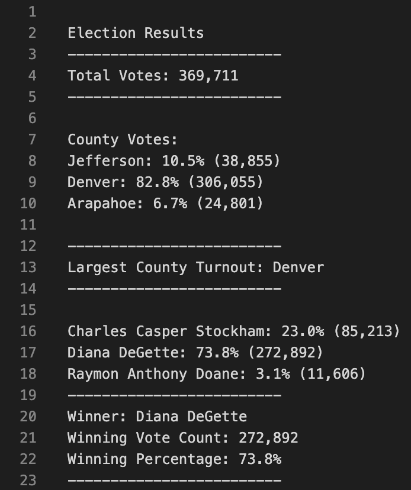

# Election_Analysis

## Overview of Election Audit
### The scope of this project was to assist the Colorado Board of Elections in an audit of an election including:

The total number of votes cast.
List of Candidates receiving votes and their percentages.
The voter turnout for each county
The percentage of votes from each county out of the total count
The county with the highest turnout 

## Election Audit Results:

### The summary of the election results:

- The total number of votes cast in this congressional election was 369,711.
- Jefferson County had 10.5% of the votes with 38,855, Denver County had the most with 82.8% and 306,055 votes, lastly Arapahoe had the fewest with 6.7% and 24,801 votes in the precinct.
- Raymon Anthony Doane had the fewest votes with 3.1% of the total (11,606 votes), Charles Casper Stockham was 2nd place with 23% (85,213) and the winner was Diana DeGette with 272,892 votes and 73.8% of the total

## Election-Audit Summary:
### This was a good framework for an election audit / data analysis. This script could be modified for National Elections by breaking down by State before further breaking down by County. It could also have a registered voters variable that would be checked against the National, State, and County total votes to ensure there wasn't more votes than registered voters to detect fraud.